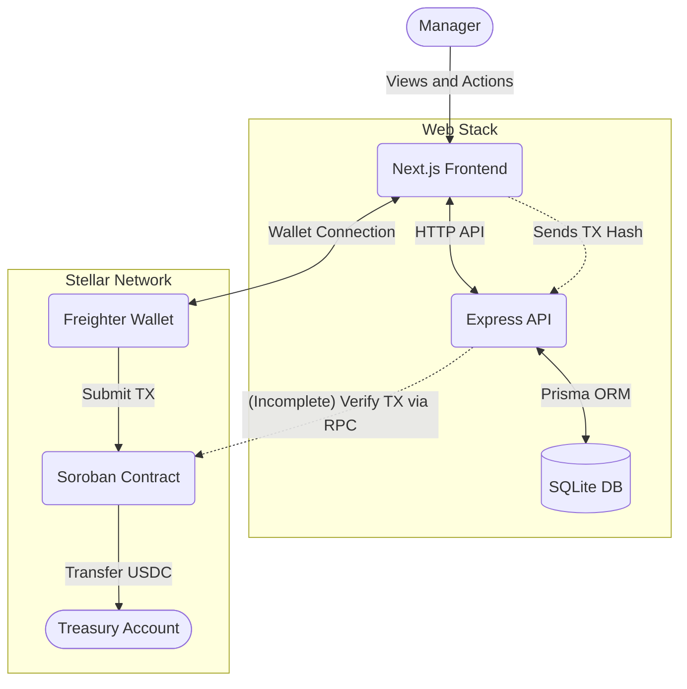

# Football-Manager-XI

An open-source football management game with a built-in FM Coin economy integrated with the Stellar blockchain. Manage your club, set your tactics, simulate matches, and handle finances to build the ultimate team.


## 🌟 Implemented Features

### Football Management Gameplay
| Feature | Status | Description |
|---|---|---|
| **Dashboard** | IMPLEMENTED | View club summary and basic stats. |
| **Squad Management** | IMPLEMENTED | View player attributes and select the starting XI. |
| **Tactics** | IMPLEMENTED | Validate and select formations (e.g., 4-4-2, 4-3-3) and mentalities (e.g., Attacking). |
| **Match Simulation** | IMPLEMENTED | Simulates scheduled fixtures, generating goals, events, and final scores. Double-simulation prevented. |
| **League Standings** | IMPLEMENTED | View the current league table with points and goal differences. |
| **Transfers & Scouting** | IMPLEMENTED | Buy players from other clubs; scout new players. |

### FM Coin Economy & Ledger
| Feature | Status | Description |
|---|---|---|
| **Club Balance** | IMPLEMENTED | Clubs start with a 100,000 FM balance. Negative balances are prevented. |
| **Transaction Ledger** | IMPLEMENTED | All expenses (scouting, transfers) and incomes are atomic and recorded in a `CoinTransaction` ledger. |
| **Scouting Costs** | IMPLEMENTED | Deducts 500 FM per scouting action. |

### Stellar Integration
| Feature | Status | Description |
|---|---|---|
| **Soroban Contract** | IMPLEMENTED | Rust contract (`fm-coin-store`) with packages, prices, and treasury transfers. |
| **Wallet Integration** | IMPLEMENTED | Frontend integrates with Freighter (`@stellar/freighter-api`) to build and sign transactions. |
| **Backend Verification** | PARTIALLY IMPLEMENTED | The `stellarController` exists, but `stellarVerificationService.ts` lacks real XDR extraction and relies on mock data. |

## 🛠 Technology Stack

* **Frontend:** Next.js (App Router), React, Tailwind CSS, Turbopack, Vitest
* **Backend:** Node.js, Express, TypeScript, Prisma (SQLite), Vitest, Node Native Test Runner
* **Blockchain:** Soroban (Rust), Stellar SDK, Freighter API

## 🏛 Architecture



*Note: The backend-to-Stellar verification flow currently relies on mock parsing and requires implementation to support real transactions.*

## 📂 Repository Structure

```text
football-manager-xi/
├── backend/            # Express API, Prisma schema, server tests
├── contracts/          # Soroban smart contracts (fm-coin-store)
├── frontend/           # Next.js web application and components
└── README.md           # This file
```

## 🚀 Getting Started

### Prerequisites
* Node.js (v20+ recommended)
* npm
* Rust & Cargo (for Soroban contracts)
* Freighter Wallet browser extension (for testing payments)

### 1. Database & Backend Setup

1. Navigate to the backend directory:
   ```bash
   cd backend
   npm install
   ```
2. Set up environment variables from the example:
   ```bash
   cp .env.example .env
   ```
3. Initialize the database and apply migrations:
   ```bash
   npm run prisma:generate
   npm run prisma:migrate
   ```
4. Seed the database with development data:
   ```bash
   npm run prisma:seed
   ```
5. Start the backend development server:
   ```bash
   npm run dev
   ```

### 2. Frontend Setup

1. Open a new terminal and navigate to the frontend directory:
   ```bash
   cd frontend
   npm install
   ```
2. Set up environment variables:
   ```bash
   cp .env.example .env.local
   ```
3. Start the frontend development server:
   ```bash
   npm run dev
   ```
4. Access the game at `http://localhost:3000`.

## 🧪 Testing and Building

**Frontend:**
```bash
cd frontend
npm run test    # Runs Vitest component tests
npm run build   # Creates optimized Next.js production build
```

**Backend:**
Due to mixed test runners, tests require specific commands:
```bash
cd backend
npm run test -- src          # Runs Stellar unit tests (Vitest)
npx tsx --test src/tests/app.test.ts  # Runs integration tests (Node Test Runner)
```

**Contracts:**
```bash
cd contracts/fm-coin-store
cargo test
```
*(Note: Requires MSVC build tools `link.exe` on Windows).*

## 🔌 API Overview

Core implemented routes (Base: `/api/v1`):

* `GET /clubs/:id/finance` - Retrieve club balance and transaction ledger.
* `PUT /clubs/:id/starting-xi` - Set validated starting lineup.
* `PUT /clubs/:id/tactics` - Set formation and mentality.
* `POST /clubs/:id/scouting` - Deducts 500 FM and returns scouted players.
* `POST /clubs/:id/players/:playerId/buy` - Transfer player ownership and exchange funds.
* `POST /fixtures/:id/simulate` - Simulate a match and record events.
* `GET /leagues/:season/table` - Retrieve current standings.
* `GET /stellar/packages` - Retrieve FM Coin purchase configurations.
* `POST /stellar/verify/:clubId` - Submit a transaction hash for backend verification.

## 🔐 Security & Limitations

* **No Authentication:** The app completely bypasses authentication. Routes blindly trust the provided `clubId`. Do not deploy publicly without implementing auth.
* **Incomplete Payment Verification:** `StellarVerificationService` throws `Malformed/missing contract event` unless provided with a test mock. It cannot currently parse real XDR from a Testnet purchase.
* **Testnet Unverified:** Because of the XDR parsing limitation, an end-to-end Testnet flow cannot be successfully completed on this commit.

## 🤝 Contribution Guidelines

This repository currently lacks a formal `CONTRIBUTING.md`, `CODE_OF_CONDUCT.md`, and issue templates. If you wish to contribute, please open an issue to discuss proposed changes before submitting a pull request.

## 📄 License

This repository does not currently contain a `LICENSE` file. All rights reserved by the author until an explicit open-source license is added.
